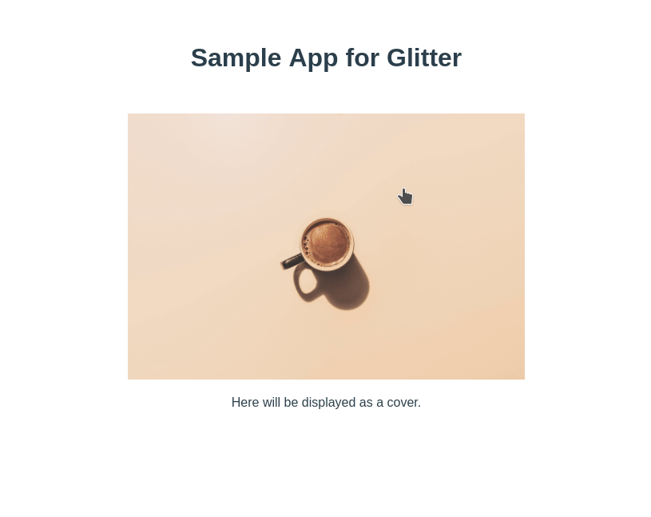

An image gallery component like Lightbox for or Vue 2.x.

(日本語のREADMEは [README.jp.org](./README.jp.md) にあります。)

# Table of Contents

1.  [Install](#org0de66bf)
    1.  [Npm](#orga5e7162)
    2.  [Browser](#org8d3d051)
2.  [Usage](#orgd639374)
    1.  [API](#org8844423)
        1.  [images: Array<string | { src: string, caption: string }>](#org69127d7)
        2.  [showPageNumbers: boolean](#orgf5bd699)
        3.  [showCloseButton: boolean](#orgfc65d2f)
        4.  [showLoading: boolean](#orgc8bfb94)
        5.  [showLoadingProgress: boolean](#orgeb6bcd0)
        6.  [repeatImages: boolean](#orga9a0049)
    2.  [Development](#orge846ab7)
        1.  [Project setup](#org039bbb5)
        2.  [Compiles and hot-reloads for development](#org460001c)
        3.  [Compiles and minifies for production](#orgd60f9a6)
        4.  [Run unit tests](#orgad18873)
        5.  [Lints files](#org6ac5ce9)
    3.  [License](#orgc70eb84)

# Install

## Npm

    npm install @asot/glitter --save

You may install Glitter component globaly:

    import Glitter from '@asot/glitter';
    import '@asot/glitter/dist//Glitter.css'
    
    Vue.component('glitter', Glitter);

Or you can register Glitter in your components:

    import Glitter from '@asot/glitter';
    import '@asot/glitter/dist//Glitter.css'
    
    export default {
      ...
      components: {
        Glitter,
      },
      ...
    };

## Browser

Include @asot/glitter in the page.

    
    
    
    <link rel="stylesheet" href="https://unpkg.com/@asot/glitter/dist/Glitter.css">
    
    

# Usage

You may now use Glitter component in your markup:

    <glitter
      v-bind:images="[
        '/path/to/image',
        { src: '/path/to/image', caption: 'Hello glitter' },
      ]"
      

        You can write arbitrary markup. 
        Here will be rendered as top.
      

    </glitter>

## API

### images: Array<string | { src: string, caption: string }>

Required, an array of image urls. You can specify a caption as well in object notation.

### showPageNumbers: boolean

Display page numbers (default to `true`).

### showCloseButton: boolean

Display a close button (default to `true`).

### showLoading: boolean

Display loding image (default to `true`).

### showLoadingProgress: boolean

Display loading progress (default to `true`).

### repeatImages: boolean

Repeat images (default to `false`).

## Development

You need [Vue Cli](https://cli.vuejs.org/).

### Project setup

    npm install

### Compiles and hot-reloads for development

    npm run serve

### Compiles and minifies for production

    npm run build

### Run unit tests

    npm run test:unit

### Lints files

    npm run lint

## License

[MIT](./LICENSE)

